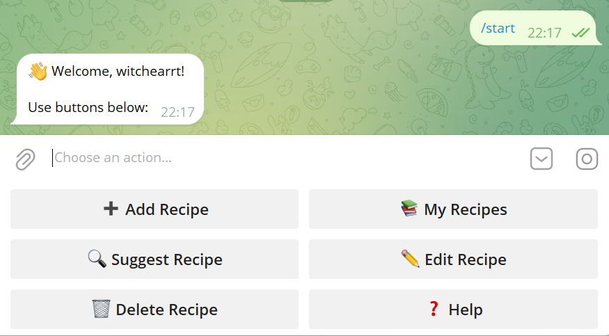
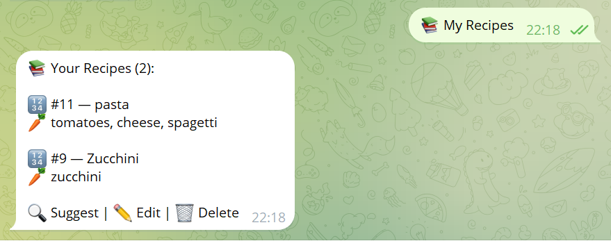
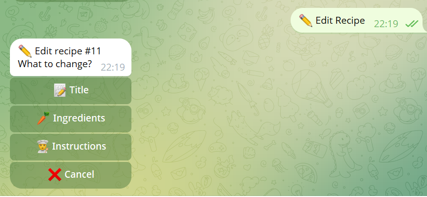
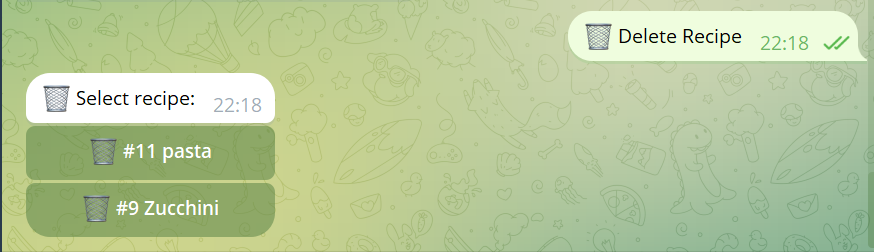

# Recipe Bot

Smart Telegram bot that helps you save, manage, and discover recipes using Integrated AI for typo correction and smart ingredient matching.

---

## Demo

### Main Menu
When you start the bot, you get a friendly menu with action buttons:



### My Recipes
View all your saved recipes in one place:



### Edit & Delete
You can easily manage your collection by editing or deleting recipes:




---

## Product Context

### End Users
- Home cooks and food enthusiasts
- Students who want quick meal ideas
- Families organizing their recipe collection
- Anyone who wants to find recipes based on ingredients they already have

### The Problem
People struggle to:
- Save and organize recipes in one place
- Find what to cook with available ingredients
- Deal with typos and ingredient naming confusion (e.g., "zucchini" vs "courgette")

### Our Solution
A Telegram bot that lets users save, manage, and discover recipes using Integrated AI for smart ingredient matching with graceful fallback to built-in synonym recognition and fuzzy typo correction.

---

## Features

### Implemented
| Feature | Description |
|---------|-------------|
| Add Recipe | Multi-step flow: title -> ingredients -> instructions |
| My Recipes | List all saved recipes with ingredient preview |
| Suggest Recipe | Find recipes by ingredients you have |
| AI Typo Correction | Integrated AI corrects typos ("tomatoe" -> "tomatoes") |
| Synonym Matching | Auto-matches synonyms (e.g., "zucchini" = "courgette") |
| Fuzzy Matching | Fallback via Python difflib if AI is unavailable |
| Edit Recipe | Edit title, ingredients, or instructions via inline keyboard |
| Delete Recipe | Delete recipes with inline confirmation |
| Ingredient Quantities | Parses quantities (e.g., "200g", "3 pcs") |
| Docker Deployment | Bot + PostgreSQL via Docker Compose |
| Auto-Migration | Database migrations preserve data on updates |

### Not Yet Implemented
| Feature | Description |
|---------|-------------|
| Recipe Categories | Organize recipes by type (breakfast, dinner, dessert) |
| Image Support | Attach photos of finished dishes |
| Recipe Sharing | Share recipes with other users |
| Meal Planning | Weekly meal planner based on available recipes |
| Nutritional Info | Calculate calories and macros per recipe |
| Voice Input | Add recipes via voice messages |
| Shopping List | Generate shopping list from selected recipes |

---

## Usage

### Start the Bot
Open Telegram and search for: **@recipes_toolkitbot**

Or send `/start` to activate the menu.

### Commands
| Command | Description |
|---------|-------------|
| `/start` | Start the bot and show menu |
| `/add_recipe` | Add a new recipe |
| `/my_recipes` | View all your recipes |
| `/suggest` | Find recipes by ingredients |
| `/edit_recipe` | Edit an existing recipe |
| `/delete_recipe` | Delete a recipe |
| `/help` | Show available commands |

---

## Deployment

### Prerequisites
- **OS:** Ubuntu 24.04 LTS (or any Linux with Docker support)
- **Docker** and **Docker Compose** installed

### What to Install on VM
```bash
# Install Docker
curl -fsSL https://get.docker.com | sh

# Install Docker Compose (usually included with Docker)
sudo apt install docker-compose-plugin
```

### Step-by-Step Deployment

#### 1. Clone the Repository
```bash
git clone https://github.com/witchearrt/se-toolkit-hackathon.git
cd se-toolkit-hackathon
```

#### 2. Configure Environment
```bash
cp .env.example .env
nano .env
```

Edit `.env` with your values:
```env
BOT_TOKEN=your_telegram_bot_token_here
DATABASE_URL=postgresql+asyncpg://postgres:postgres@db:5432/recipes

# GigaChat AI (optional - bot works without it using built-in synonyms)
GIGACHAT_CLIENT_ID=your_client_id_here
GIGACHAT_CLIENT_SECRET=your_client_secret_here
GIGACHAT_SCOPE=GIGACHAT_API_PERS
GIGACHAT_AUTH_URL=https://ngw.devices.sberbank.ru:9443/api/v2/oauth
GIGACHAT_API_URL=https://gigachat.devices.sberbank.ru:443/api/v1/chat/completions
```

#### 3. Get Telegram Bot Token
1. Open Telegram and search for **@BotFather**
2. Send `/newbot` and follow the instructions
3. Copy the token and paste it into `.env`

#### 4. (Optional) Get GigaChat API Credentials
1. Register at [GigaChat Developers](https://developers.sber.ru/gigachat)
2. Create a project and get your `CLIENT_ID` and `CLIENT_SECRET`
3. Paste them into `.env`

> **Note:** The bot works without GigaChat using built-in synonym dictionary and fuzzy matching as fallback.

#### 5. Start the Services
```bash
docker compose up -d
```

This starts:
- **recipe-db** - PostgreSQL 15 database
- **recipe-bot** - Python bot with aiogram

#### 6. Verify
```bash
docker compose ps
docker compose logs -f bot
```

You should see:
```
Bot is starting...
INFO:aiogram.dispatcher:Run polling for bot @your_bot_name
```

#### 7. Run Database Migration (if needed)
```bash
docker compose exec bot python migrate.py
```

### Stopping the Bot
```bash
docker compose down
```

### Updating
```bash
git pull
docker compose down
docker compose up -d --build
```
